# Experiment logbook

A running scientific record of experiments in this repository. Each entry documents one
experiment: what was asked, exactly what was run, what was measured, what the evidence
supports, and what remains open.

Entries are append-only. When a later experiment changes how an earlier result should be
read, the earlier entry is not rewritten — a note is added to its claim ledger pointing at
the later entry.

**Conventions used throughout.**

| Symbol | Meaning |
|---|---|
| `T_s` | **sampling** temperature — shapes the nucleus distribution a position's grouping label is drawn from |
| `T_g` | **loss / gradient** temperature — shapes the objective whose parameter gradient is measured |
| `D` | number of analyzed evaluation positions |
| `M` | number of measured loss temperatures |
| `K` | CountSketch width |
| `within` | pooled mean estimated directional similarity between distinct positions in the same class |
| `between` | pooled mean estimated directional similarity across classes |
| `Δ` | `within − between` |

`T_s` and `T_g` are independent knobs and are never used interchangeably. The supervised
gradient target is always the **true next token** `y_d`; a nucleus-sampled token is a
grouping label and is never substituted as the training target.

---

# Entry 1 — Does loss temperature, or only sampling temperature, drive gradient-direction clustering at initialization?

**Run identifier** `20260824-174741__wikitext2-raw-train1k__mistral-7b-v0.1-32k__llama-tiny-32k__N32768-I12-R1__c230733d`
**Date** 2026-08-24 (measurement started 17:47:41 UTC)
**Code commit** `7ef6b4a` — the revision that produced the measurement. Later commits on
`gradient-directional-clustering` are documentation-only and did not touch this run.
**Status** complete; analysis current.

## 1. Question and motivation

Earlier work established that per-position gradients at random initialization are not
directionally isotropic: positions sharing a token label have gradients that are more
aligned with each other than with the rest. Two groupings showed this — by **true target
token** and by **greedy prediction**.

A natural follow-up is to heat the grouping: instead of the deterministic target or greedy
label, group positions by the token that **nucleus sampling** actually draws at temperature
`T_s`, and sweep `T_s`. That was already possible, and it showed clustering decaying as
`T_s` rises.

That experiment, however, confounds nothing but is also *limited*: it holds the gradient
field fixed at the canonical `T_g = 1` and only relabels positions. The question this entry
answers is what happens when the **gradient field itself** is measured at a different loss
temperature:

- **fixed-gradient control** — `Δ(T_s = T, T_g = 1)`: only the grouping is heated;
- **matched temperature** — `Δ(T_s = T, T_g = T)`: grouping and geometry are heated together.

Comparing them separates *"positions were relabelled"* from *"the gradients themselves
changed direction"*. The two designs are computed from **one** gradient measurement, so the
comparison is exactly controlled: identical positions, identical labels per `T_s`, identical
estimator, differing only in which measured gradient field is read.

## 2. Provenance

| Item | Value |
|---|---|
| Code commit | `7ef6b4a` |
| Branch context | `gradient-directional-clustering` |
| Dataset | WikiText-2 raw, `Salesforce/wikitext`, subset `wikitext-2-raw-v1` |
| Dataset slice | `train[:1000]`, prepared corpus `wikitext2_raw_train1k` |
| Corpus size | 45,549 tokens (analysis split `train`, 45,549 tokens) |
| Tokenizer | `mistralai/Mistral-7B-v0.1`, pretrained, via `transformers.AutoTokenizer` |
| Tokenizer revision | `27d67f1b5f57dc0953326b2601d68371d40ea8da` (requested; resolved from local cache) |
| Special tokens on encode | none added |
| Vocabulary | 32,000 canonical |
| Excluded structural tokens | IDs `0, 1, 2` (`<unk>`, `<s>`, `</s>`) |
| Eligible vocabulary | 31,997 |
| Model | `llama_tiny`, 2 layers, dim 128, 4 heads, 2 KV heads, vocab 32,000 |
| Parameter count | 8,585,856 across 21 tensors |
| Initialization protocol | random; scale `alpha = 1.0` (a literal no-op) |
| Initializations | 12, seeds 1000–1011 |
| Evaluation positions | `D` = 32,768 = 512 windows × 64 tokens, evenly spaced, deterministic |
| Nucleus replicates | `R` = 1 |
| Forward batch size | 4 |
| Device | CUDA |
| Input conditions | real, shuffled (seed 60001), Gaussian embeddings (seed 60002) |
| Sampling policy | temperature/top-p nucleus, canonical `T = 0.6`, `top_p = 0.9`, sampling seed 20240601 |
| Common random numbers | yes |
| Sampling temperatures `T_s` | 0.12, 0.24, 0.36, 0.48, 0.60, 1.20 |
| Measured loss temperatures `T_g` | 0.12, 0.24, 0.36, 0.48, 0.60, **1.00**, 1.20 (`M` = 7) |
| Gradient objective | `L_d(T_g) = −log softmax(z_d / T_g)[y_d]`, softmax over the eligible support |
| Gradient target | true next token `y_d` |
| `T²` compensation | none |
| Gradient initialization | index 0, seed 1000, real input |
| CountSketch width | `K` = 512 |
| CountSketch map | signed feature hashing, production Torch generator, seed 20240917 |
| Permutation nulls | 256 draws; nucleus/target/greedy seed 20240918; cross-partition seed 20240919 |
| Measurement wall time | 3,016.8 s total; 2,861.9 s in the gradient pass (11.4 positions/s) |
| Peak RSS | 2,205.4 MiB |
| Base record | `analyses/initialization_distribution.npz`, 594,212,529 bytes |
| Base record SHA256 | `711a8ae508072e1626bd5395b70dfd2631d6a63e5370f9e6a507f615617a30bf` |

**Not applicable to this entry** — this experiment measures a model *at initialization*, with
no parameter update of any kind:

| Item | Status |
|---|---|
| Optimizer | not applicable — no parameter update in this experiment |
| Learning rate / schedule | not applicable |
| Training steps | not applicable — 0 |
| Checkpoint | not applicable — weights are the initialization itself |
| Loss history | not applicable — no training dynamics |

These rows are kept so that future entries studying training dynamics can fill them in
against the same schema.

## 3. Exact launch command

From the repository root:

```bash
python3 scripts/run_initialization_distribution_experiment.py \
  --data-config configs/data/wikitext2_subword.yaml \
  --model-config configs/model/tiny_llama_32k.yaml \
  --experiment-config configs/experiment/initialization_distribution.yaml \
  --initialization-scale 1.0 \
  --num-initializations 12 \
  --num-windows 512 \
  --num-replicates 1 \
  --forward-batch-size 4 \
  --gradient-analysis \
  --gradient-sketch \
  --gradient-vector-split \
  --gradient-temperatures 0.12 0.24 0.36 0.48 0.60 1.00 1.20 \
  --offline \
  --output-dir outputs
```

`--gradient-temperatures` selects the loss temperatures at which gradient **fields** are
measured. `T_g = 1.00` is included deliberately: it is the canonical field, it is what the
control design reads, and the record's canonical norm and sketch arrays are that row.

This is the expensive step — one backward pass per position per loss temperature, here
32,768 × 7 — and it produces a ~570 MB record. Everything below is derived from it without
recomputation.

## 4. Derived-analysis commands

With `RUN` set to the finished run directory. Configuration is taken from the run's own
snapshots, not from `configs/`, so a later edit to the repository configs cannot silently
change what is reconstructed.

```bash
RUN=/path/to/run

# Fixed-gradient control: T_s varies, T_g pinned at 1. This is Figure 22.
python3 scripts/write_nucleus_clustering_artifact.py "$RUN/analyses" \
  --data-config  "$RUN/config/data_config.yaml" \
  --model-config "$RUN/config/model_config.yaml" \
  --sampling-temperatures 0.12 0.24 0.36 0.48 0.60 1.20 \
  --loss-temperatures     1.0  1.0  1.0  1.0  1.0  1.0
cp "$RUN/analyses/nucleus_gradient_clustering.npz" \
   "$RUN/analyses/nucleus_gradient_clustering_control_Tg1.npz"

# Matched temperature: T_g = T_s elementwise.
python3 scripts/write_nucleus_clustering_artifact.py "$RUN/analyses" \
  --data-config  "$RUN/config/data_config.yaml" \
  --model-config "$RUN/config/model_config.yaml" \
  --sampling-temperatures 0.12 0.24 0.36 0.48 0.60 1.20 \
  --loss-temperatures matched
cp "$RUN/analyses/nucleus_gradient_clustering.npz" \
   "$RUN/analyses/nucleus_gradient_clustering_matched_TsTg.npz"

# Target-versus-greedy cross-partition geometry (Figure 24).
python3 scripts/write_cross_partition_artifact.py "$RUN/analyses"

# Figures.
python3 scripts/render_record_figures.py "$RUN/analyses" --figures-dir "$RUN/figures"
```

Both nucleus designs write the same filename and there is no output-name flag, so each
result is copied aside immediately. **The canonical `nucleus_gradient_clustering.npz` must
end as the control copy**, because Figure 22 reads that name and Figure 22 is defined as the
fixed-`T_g = 1` control.

### Execution notes

The measurement completed successfully and was **not repeated**. The orchestration wrapper
then failed at its run-path resolution step — an operational bug in the wrapper, after the
expensive work was already written to disk. Post-processing was resumed from the completed,
immutable record. The base record's SHA256 was recorded immediately after measurement and
re-checked after all downstream analyses and rendering; it was unchanged, confirming that no
derived analysis wrote to it.

Two independent reconstruction gates passed before any statistic was computed: the recovered
nucleus labels reproduced the recorded token histograms with **exact integer equality at all
six `T_s`** (0 differing bins, max difference 0, total absolute difference 0), and the raw
temperature-resolved arrays validated with the canonical `T_g = 1` slice **exactly equal** to
the legacy canonical norm and sketch fields.

## 5. Observables and how they are constructed

**Directional representation.** Comparing 32,768 full gradients pairwise in 8.6 M dimensions
is infeasible (the exact `[D, P]` matrix is ~1 TB), so direction is compared through a
CountSketch projection. The normalized representation is

```text
u_d = S(g_d) / ||g_d||
```

where `S(·)` is the production count sketch and `||g_d||` is the **exact** full-parameter
gradient norm — *not* the sketch's own length. With that divisor the inner product `⟨u_a, u_b⟩`
is an unbiased estimator of the true cosine between `g_a` and `g_b`. Two consequences matter
when reading every number below:

- `||u_d||` is not 1, so within-class identities subtract the measured `Σ||u_d||²`, not a count;
- values are **not confined to `[-1, 1]`** and are not clipped. They are *estimated* gradient
  cosine similarities, with error scaling as `1/√K`. Differences at the third decimal place
  should not be read as exact geometry.

Exact-versus-sketch fidelity is validated separately by a dedicated small methodological run
(Figure 23), which is deliberately **not** part of this scientific run — it retains complete
gradients for a handful of positions and the code documents it as unsuitable at full scale.
No fidelity figure is therefore expected in this entry's output, and its absence is not a
defect of this run.

**Clustering statistic.** For a grouping of positions into token classes,

```text
Δ = within − between
```

pooled over **every** position from class sums rather than by enumerating pairs. A singleton
class contributes no within-class pair but still forms between-class pairs, so it is not
silently dropped.

**Permutation null.** Labels are permuted across the fixed gradient positions, preserving the
realized class-size structure exactly, 256 draws. It therefore tests association between
labels and directions **conditional on the observed support structure**. It does *not* cover
sampling-replicate variability (`R` = 1 here), initialization variability, or CountSketch
approximation error.

## 6. Main findings

### 6.1 The gradient-direction field is almost invariant to `T_g` — except at the coldest temperature

`data/directional_temperature_sanity.tsv` reports, per `T_g`, the same-position estimated
similarity `⟨u_d(T_g), u_d(1)⟩` across all 32,768 positions:

| `T_g` | mean | median | Q1 | Q3 |
|---|---|---|---|---|
| 0.12 | 0.9258 | 0.9337 | 0.8760 | 0.9808 |
| 0.24 | 0.9968 | 0.9956 | 0.9576 | 1.0352 |
| 0.36 | 0.9987 | 0.9973 | 0.9592 | 1.0370 |
| 0.48 | 0.9988 | 0.9975 | 0.9594 | 1.0371 |
| 0.60 | 0.9988 | 0.9975 | 0.9594 | 1.0371 |
| 1.00 | 0.9988 | 0.9975 | 0.9595 | 1.0372 |
| 1.20 | 0.9988 | 0.9975 | 0.9595 | 1.0371 |

Changing the loss temperature from 1 to anything in 0.24–1.2 leaves each position's gradient
pointing in essentially the same direction. Only `T_g = 0.12` produces a visible rotation.
The Q3 column exceeding 1 is the expected behaviour of an unclipped sketch estimator and is
itself a reminder not to over-read the last digits.

This is a **descriptive directional diagnostic**, not an exact cosine analysis.

### 6.2 Gradient magnitude scales with `1/T_g`; direction does not follow

Per-position gradient norms (`supporting_material/record_statistics.json`):

| `T_g` | mean `‖g‖` | p05 | p50 | p95 |
|---|---|---|---|---|
| 0.12 | 110.27 | 102.18 | 107.59 | 127.26 |
| 0.24 | 50.98 | 49.66 | 50.65 | 53.47 |
| 0.60 | 20.35 | 19.83 | 20.22 | 21.34 |
| 1.00 | 12.21 | 11.90 | 12.13 | 12.80 |
| 1.20 | 10.17 | 9.91 | 10.11 | 10.67 |

Two things at once: the *scale* moves by roughly `1/T_g` (a factor ≈ 10.8 from `T_g = 1.2` to
`0.12`), while the *spread across positions within one temperature* is tight — at `T_g = 1`
the p05–p95 band is ±4 % of the mean. Magnitude and direction must be kept apart: §6.1 shows
direction is nearly unchanged over most of the same range where magnitude changes tenfold.

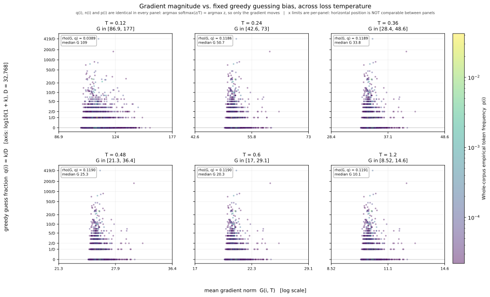

*Figure 10 — per-token mean gradient norm against the initial guessing bias, one panel per
loss temperature. Because `argmax softmax(z/T) = argmax z`, the guess fractions are identical
in every panel; only the gradient axis moves. Read it as the magnitude counterpart to §6.1.*

### 6.3 Clustering by target and by greedy prediction is large and far outside the null

At the canonical `T_g = 1`, grouping the same 32,768 gradients two ways:

| Grouping | `Δ` | permutation null (2.5–97.5 %) |
|---|---|---|
| true target token | **+0.129874** | [-0.000118, +0.000138] |
| greedy prediction | **+0.117973** | [-0.000119, +0.000175] |

Both are roughly three orders of magnitude outside their nulls. Between-class similarity sits
near zero while within-class similarity is clearly positive, which is the signature of
token-conditioned directional structure at initialization.

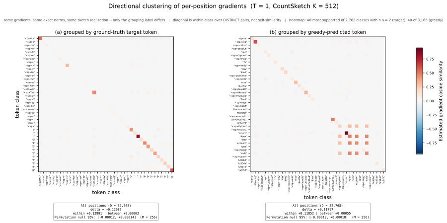

*Figure 20 — pooled `within`, `between` and `Δ` for both groupings, with permutation nulls and
per-class heatmaps.*

**Observation.** Both groupings show strong, highly significant clustering.
**Caveat.** The target and greedy values (0.1299 vs 0.1180) should **not** be compared at fine
resolution: both rest on the same CountSketch approximation, and the entry makes no claim that
one grouping is "more clustered" than the other.

### 6.4 Heating the sampling temperature destroys the clustering — and it vanishes into the null by `T_s = 1.2`

The fixed-gradient control, `Δ(T_s, T_g = 1)`:

| `T_s` | `Δ` | null (2.5–97.5 %) | outside null? | `Δ` / null upper |
|---|---|---|---|---|
| 0.12 | +0.090904 | [-0.000214, +0.000269] | yes | 338× |
| 0.24 | +0.049118 | [-0.000544, +0.000567] | yes | 87× |
| 0.36 | +0.010724 | [-0.000852, +0.000750] | yes | 14× |
| 0.48 | +0.003707 | [-0.000748, +0.000760] | yes | 4.9× |
| 0.60 | +0.001558 | [-0.000872, +0.000840] | yes | 1.9× |
| 1.20 | +0.000289 | [-0.000949, +0.000745] | **no — inside the null** | 0.4× |


*Figure 22 — the canonical control. `T_s` varies; `T_g = 1` is fixed for every point, so the
gradients are the same canonical field throughout and only the grouping is heated.*

**Observation.** `Δ` falls monotonically by more than two orders of magnitude across the sweep
and, at `T_s = 1.2`, is no longer distinguishable from the label-permutation null.

**Interpretation, with its limit.** Part of this decay is a genuine weakening of
label–direction association, but part is **support evaporation**, and the two are not
separated by this figure alone. From `data/nucleus_support_and_nulls.tsv`:

| `T_s` | represented classes | qualifying (≥2) | singleton fraction | positions in qualifying classes | largest class | within-class pairs |
|---|---|---|---|---|---|---|
| 0.12 | 11,111 | 4,641 | 0.582 | 0.803 | 754 | 1,540,182 |
| 0.24 | 18,555 | 7,982 | 0.570 | 0.677 | 87 | 69,978 |
| 0.60 | 20,387 | 8,768 | 0.570 | 0.645 | 7 | 34,024 |
| 1.20 | 20,456 | 8,733 | 0.573 | 0.642 | 7 | 33,790 |

The within-class pair count collapses by a factor of 45 between `T_s = 0.12` and `T_s = 0.24`
and the largest class shrinks from 754 members to 87. By `T_s = 0.6` the biggest class has 7
members. So at high `T_s` the statistic rests on very little support, which both weakens any
real signal and widens the null. Note the three support quantities are different denominators
and must not be conflated: *fraction of positions in a sufficiently supported class* (0.80 →
0.64), *fraction of represented classes that are singletons* (≈0.57, essentially flat), and
*number of within-class pairs* (1.54 M → 34 k).

### 6.5 Matched `T_g = T_s` changes the answer only at the coldest temperature — and there it triples `Δ`

This is the central comparison of the entry. Both designs use identical positions, identical
labels per `T_s`, and identical support (the support table above is the same for both); they
differ *only* in which measured gradient field is read.

| `T_s` | `Δ(T_s, T_g=1)` control | `Δ(T_s, T_g=T_s)` matched | difference |
|---|---|---|---|
| 0.12 | +0.0909042 | **+0.2739332** | **+0.1830290** |
| 0.24 | +0.0491182 | +0.0514853 | +0.0023671 |
| 0.36 | +0.0107243 | +0.0107453 | +0.0000210 |
| 0.48 | +0.0037075 | +0.0037105 | +0.0000030 |
| 0.60 | +0.0015584 | +0.0015581 | -0.0000003 |
| 1.20 | +0.0002894 | +0.0002894 | +0.0000001 |

<p align="center">
  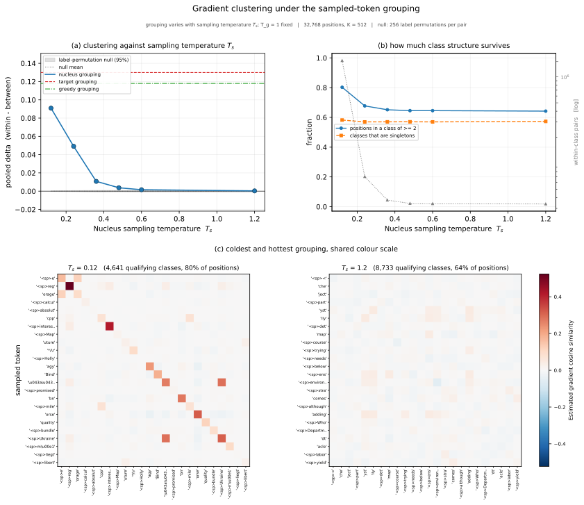
  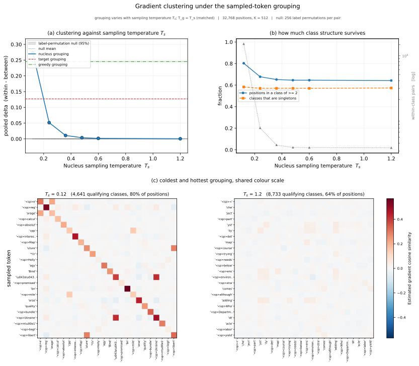
</p>

*Left: control, `T_s` varies with `T_g = 1`. Right: matched, `T_g = T_s`. Same positions, same
labels, same estimator — only the gradient field differs.*

**Observation.** For `T_s ≥ 0.36` the two designs agree to five decimal places. At `T_s = 0.24`
the matched value is ~5 % higher. At `T_s = 0.12` the matched `Δ` is **three times** the
control.

**Interpretation — the two effects separate cleanly.** This maps onto §6.1 point for point.

*Sampling / grouping effect.* Changing `T_s` re-partitions the **same** positions using
different nucleus-sampled labels, and fragments the classes as it does so (§6.4). Over
`T_g >= 0.24` the underlying gradient directions are nearly unchanged — same-position
estimated similarity to the `T_g = 1` field is about 0.999 — so for `T_s >= 0.36`
essentially *all* of the temperature dependence in Figure 22 is attributable to the changing
labels and the collapsing class support, not to any movement of the gradient field.

*Loss-temperature effect.* Changing `T_g` changes the objective itself,
`L_d(T_g) = -log softmax(z_d / T_g)[y_d]`, with the supervised target still the true next
token. Over most of the measured range this has almost no directional consequence. It becomes
substantial only at the coldest measured point, `T_g = 0.12`, where the field's same-position
estimated similarity to `g(1)` falls to 0.926 and matched clustering rises to three times the
control.

So the decay of `Δ` along Figure 22 is **overwhelmingly a sampling-label effect**. Loss
temperature contributes essentially nothing over `T_g >= 0.24`, and contributes strongly only
in the cold limit — where, notably, it *increases* clustering rather than decreasing it.

**Scope.** This decomposition is established only over the measured grid. `T_g < 0.12` is
unmeasured, and the single cold point carries the entire loss-temperature effect.

**What the cold heatmaps show.** Comparing the 40 displayed classes at `T_s = 0.12` (computed
from the stored display matrices, not read off the image):

| Design at `T_s = 0.12` | diagonal (within-class) mean | off-diagonal mean | difference |
|---|---|---|---|
| control, `T_g = 1` | +0.1496 | +0.0061 | +0.1435 |
| matched, `T_g = 0.12` | +0.2584 | +0.0079 | +0.2505 |

The matched cold heatmap **strengthens** the existing diagonal rather than reorganizing it:
the off-diagonal stays near zero while the diagonal roughly doubles. At the hottest
temperature both designs are identical (`T_g = 1.2` and `T_g = 1` fields are indistinguishable),
with a diagonal mean of -0.0036 against an off-diagonal of +0.0015 — no structure, on classes
of 5–7 members.

### 6.6 The cold regime amplifies the greedy-defined grouping specifically

The matched artifact stores target-defined and greedy-defined reference clustering at **every**
measured `T_g` (`data/reference_clustering_by_loss_temperature.tsv`). All values lie far
outside their permutation nulls, whose upper bounds are about +0.00017.

| `T_g` | true-target-defined `Δ` | greedy-defined `Δ` |
|---|---|---|
| 0.12 | +0.126978 | **+0.245281** |
| 0.24 | +0.129659 | +0.121589 |
| 0.36 | +0.129772 | +0.118394 |
| 0.48 | +0.129817 | +0.118128 |
| 0.60 | +0.129841 | +0.118050 |
| 1.00 | +0.129874 | +0.117973 |
| 1.20 | +0.129882 | +0.117960 |

> **OBSERVATION.** Grouping by the **true target token** gives clustering essentially
> unaffected by loss temperature: `Δ` moves only from +0.129882 to +0.126978 across a tenfold
> change in `T_g`, and is flat to four decimals over `T_g >= 0.24`. Grouping by the
> **greedy-predicted token** is equally flat at about +0.118 over `T_g >= 0.24`, but **more
> than doubles, to +0.245281, at `T_g = 0.12`**. The cold-regime effect of §6.5 is therefore
> not a general strengthening of token-conditioned structure — it is specific to the
> greedy-defined grouping.

> **MECHANISTIC HYPOTHESIS — not established by this experiment.** As `T_g` falls toward 0,
> `softmax(z_d / T_g)` concentrates on the argmax, which is by definition the greedy-predicted
> token. The output-layer contribution to the gradient would then become increasingly dominated
> by token-specific structure tied to that token, so positions sharing a greedy prediction
> would share an increasingly large common component, while positions sharing only a true
> target would not. That would produce the observed asymmetry, and would also account for §6.5,
> since at `T_s = 0.12` nucleus sampling is nearly deterministic and the sampled label is close
> to the greedy label.
>
> This is a *plausible account consistent with three separate observations* (§6.1, §6.5, §6.6).
> It was **not tested here**, the evidence is compatible with other explanations, and a single
> cold point is a thin basis for a mechanism.
>
> **Proposed test, not performed in this entry.** Decompose the gradient into output-embedding
> and backbone parameter blocks and recompute the greedy-defined `Δ` within each block at
> `T_g = 0.12` and `T_g = 1`. The hypothesis predicts the amplification is concentrated almost
> entirely in the output-embedding block. The existing vector-split machinery already separates
> gradients by parameter group, so this needs a per-block sketch at two temperatures rather
> than a new measurement primitive.

## 7. Supporting evidence and diagnostics

### 7.1 Are 32,768 positions enough to represent the split?

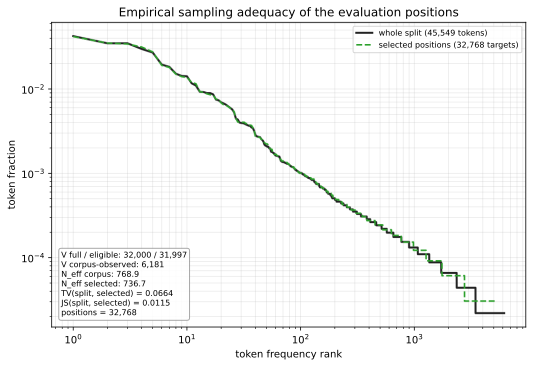

The evaluation positions are compared against the analysis split they are drawn from:
total variation 0.0664, Jensen–Shannon 0.0115, the selection covers 97.8 % of corpus token
mass, and represents 5,296 of the 6,181 token types observed in the split. Effective support
is 736.7 for the selection against 768.9 for the corpus.

**Supported statement.** The analyzed positions reproduce the split's token distribution
closely in aggregate — small divergences, nearly all mass covered, comparable concentration.
**Not supported.** That the sample is "sufficient" without qualification: 885 rare token types
in the split never appear as a target, so per-token statements about rare tokens rest on few
or zero positions. The relevant comparison is *positions versus their own split*, not versus
natural language.

### 7.2 The two guessing policies produce very different concentration

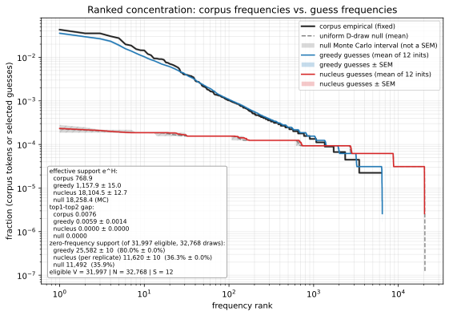

Mean effective support over 12 initializations: corpus 768.9, **greedy 1,157.9** (SEM 15.0),
**nucleus 18,104.5** (SEM 12.7), against 31,997 eligible tokens.

**Supported.** The sampling policy changes assignment statistics drastically. Greedy is far
more concentrated than nucleus, and its concentration is within a small factor of the corpus's,
while nucleus is an order of magnitude flatter and close to the uniform categorical output
null — at the canonical `T = 0.6` its effective support is 99.0 % of the null's.

**Requires care.** Figure 1 ranks profiles independently, so it compares *concentration*, not
*token identity*. Greedy being close to the corpus in concentration does **not** mean it picks
the corpus's tokens: the nucleus total variation to the corpus is 0.866 at `T = 0.6` and stays
≈0.87 at every sweep temperature, and greedy leaves 4,944 corpus-observed token types never
guessed at all. The precise repository term for the reference is the **uniform categorical
output null**; it is a finite-sampling reference, and it is reasonable to read proximity to it
as *absence of token-specific bias in the assignment statistics*, but "NO-IGB" is not a term
this repository defines and is avoided here.

### 7.3 Input structure: the two policies respond completely differently

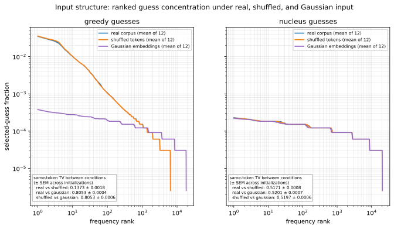

*Figure 4 - one initialized model, three inputs, one panel per policy. Each condition is
ranked independently and then aggregated rank by rank, so this panel compares distribution
**shape**, not which tokens are chosen. The paired same-token distances below answer the
identity question.*

Three inputs pass through identical weights: the real corpus windows, the same token multiset
with its ordering destroyed, and synthetic Gaussian vectors injected at the embedding
boundary. The **uniform categorical assignment null** is a separate, fourth reference - a
finite-sampling model of `D` draws over the eligible support, not an input condition. Gaussian
input is an *intervention on the model's input*, and conflating it with the null would confuse
"the model stops discriminating" with "the counts came from uniform draws".

Effective support by policy and condition, against the null's 18,258.4:

| Policy | real | shuffled | Gaussian | null |
|---|---|---|---|---|
| greedy | 1,157.9 (0.063 of null) | 1,136.9 (0.062) | **15,453.2 (0.846)** | 18,258.4 |
| nucleus | 18,104.5 (0.992) | 18,123.0 (0.993) | 18,259.1 (1.000) | 18,258.4 |

Paired same-token total variation, computed within each initialization (12 initializations,
± SEM):

| Policy | real vs shuffled | real vs Gaussian |
|---|---|---|
| greedy | 0.1373 ± 0.0018 | **0.8053 ± 0.0004** |
| nucleus | 0.5171 ± 0.0008 | 0.5201 ± 0.0007 |

**Resolved.** The draft left this open; the persisted evidence settles it, and the original
intuition is confirmed and now quantified.

- **Greedy is highly sensitive to the Gaussian intervention.** Replacing real embeddings with
  Gaussian vectors multiplies greedy's effective support by 12.3× (+14,295) and moves the
  same-token distribution almost completely (TV 0.805). Greedy under Gaussian input reaches
  0.846 of the null's effective support, having been at 0.063 under real input.
- **Nucleus is almost insensitive.** The same intervention changes nucleus effective support by
  155, which is 0.9 % of its own support, and its same-token TV to the Gaussian condition
  (0.520) is no larger than its TV to the shuffled condition (0.517) - the Gaussian
  intervention is not distinguishable, by this measure, from merely reshuffling the input.
- **The sensitivity is to the embedding intervention, not to word order.** Destroying token
  order barely moves greedy (TV 0.137, effective support -21). Only replacing the embeddings
  does. "Input structure" is therefore too coarse a description of what greedy responds to.

This asymmetry has a straightforward reading. Greedy reports the argmax, which is a
fine-grained property of the logit vector and can be redirected wholesale when the input
distribution changes. Nucleus sampling at `top_p = 0.9` already draws from a very broad head at
initialization, so its assignment statistics are close to the null before the intervention and
have little room to move.

The condition-resolved sweep sharpens the same point. Effective support as a fraction of the
null, by condition, across the nucleus sweep:

| `T_s` | 0.12 | 0.24 | 0.36 | 0.48 | 0.60 | 1.20 |
|---|---|---|---|---|---|---|
| real | 0.208 | 0.812 | 0.958 | 0.982 | 0.990 | 0.997 |
| shuffled | 0.206 | 0.812 | 0.958 | 0.983 | 0.991 | 0.996 |
| Gaussian | **0.882** | 0.974 | 0.992 | 0.997 | 0.998 | 0.997 |

Under Gaussian input the cold-temperature regime that separates real from shuffled has largely
disappeared: at `T_s = 0.12` the Gaussian condition is already at 0.882 of the null while real
input is at 0.208. Cold sampling concentrates on the argmax, and it is precisely the argmax
that the Gaussian intervention disrupts.

**Caveat.** All effective-support numbers compare *concentration*; the same-token TV columns
are what carry token identity. Both are reported above so the two are not conflated.

### 7.4 The temperature crossover is gradual, not a threshold

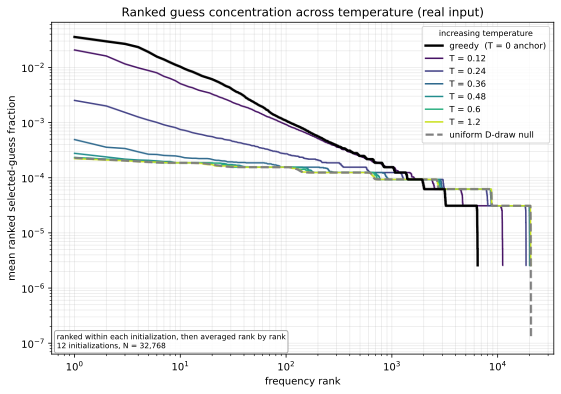

Nucleus sweep under real input, effective support as a fraction of the null, and ranked total
variation to each anchor:

| `T_s` | support / null | TV to greedy | TV to uniform null | agreement with greedy |
|---|---|---|---|---|
| 0.12 | 0.208 | 0.207 | 0.423 | 0.374 |
| 0.24 | 0.812 | 0.547 | 0.086 | 0.042 |
| 0.36 | 0.958 | 0.608 | 0.021 | 0.0073 |
| 0.48 | 0.982 | 0.618 | 0.0083 | 0.0024 |
| 0.60 | 0.990 | 0.620 | 0.0049 | 0.0010 |
| 1.20 | 0.997 | 0.622 | 0.0032 | 0.00015 |

**Supported.** The transition from greedy-like to null-like behaviour is **monotone and
gradual**, and most of it happens between `T_s = 0.12` and `T_s = 0.36`. By `T_s = 0.36` the
profile is already at 96 % of the null's effective support.
**Not supported.** A sharp transition temperature. Nothing here identifies a critical point;
the movement is smooth and largely complete before the middle of the sweep.

### 7.5 Temperature changes confidence, not the identity of the winner

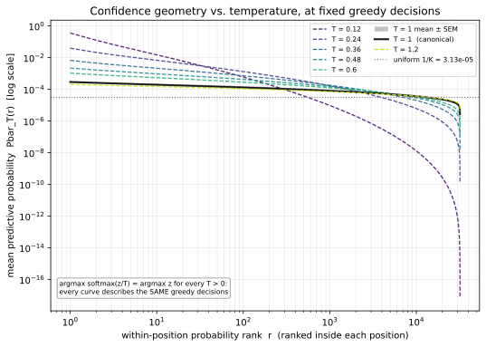

Effective support of the predictive distribution and the mean probability of the
greedy-selected token:

| `T` | effective support | mean max probability |
|---|---|---|
| 0.12 | 24.7 | 0.3388 |
| 0.36 | 9,058.0 | 0.00637 |
| 1.00 | 27,097.1 | 0.000278 |
| 1.20 | 28,506.6 | 0.000197 |

**Supported.** Temperature changes probability concentration by orders of magnitude, from a
near-deterministic distribution over ~25 effective tokens to a nearly uniform one over ~28,500
of 31,997.
**Important qualification.** These are *diagnostic* temperatures applied to the same logits:
nothing is sampled or truncated. Because `argmax softmax(z/T) = argmax z`, the identity of the
top-ranked token is **temperature-invariant** — the record asserts this explicitly. Temperature
here changes how much mass the winner carries, not who wins. At `T = 1` the winner carries only
8.9× the uniform probability, so the untrained model is close to uninformative.

### 7.6 Per-position skew is real; persistent token identity is not

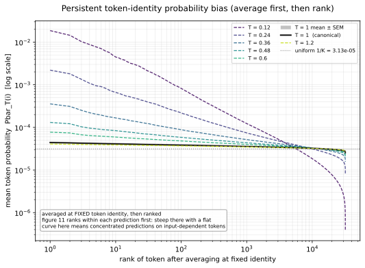

The distinction is the entire point of the figure and is easy to state backwards:

- **Figure 8/11** rank probabilities *within each position*, then average at equal rank;
- **Figure 14** averages at *fixed token identity* across positions, then ranks.

Figure 8's ranked profile has a dynamic range of 108× (rank 1 = 8.89× uniform); Figure 14
answers whether the *same* tokens are favoured across positions.

**Supported.** An individual prediction is measurably concentrated relative to uniform.
**The researcher's reading — that the skew largely disappears after identity-wise averaging,
implying the high-probability tokens are not a stable set — is the right question and is what
the pair of figures is designed to answer.** The quantitative comparison of the two profiles'
dynamic ranges is not restated here from a single stored scalar; see §10.

### 7.7 The two partitions organize the same gradients differently

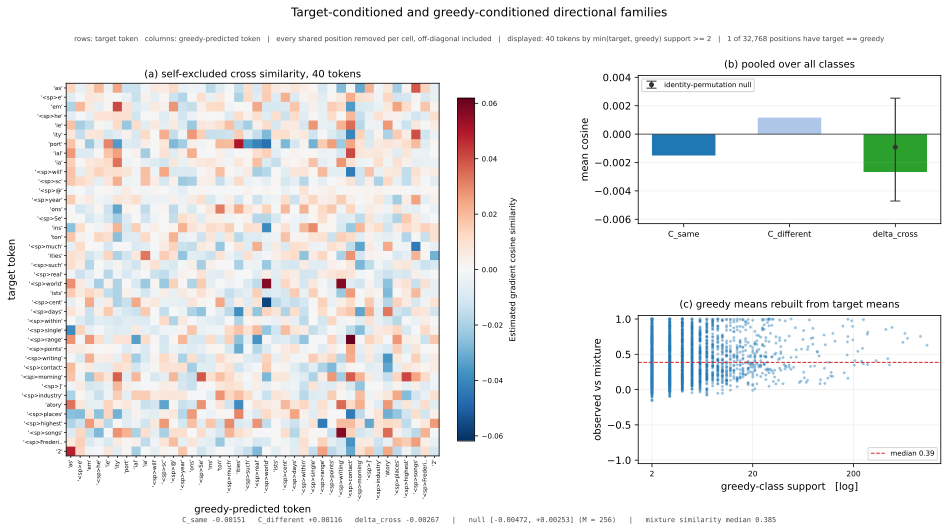

Figure 20 established that each partition has internal structure. This asks a different
question: do the two partitions line up *with each other*?

With target-defined classes `A_i` (positions whose true next token is `i`) and greedy-defined
classes `B_j` (positions whose greedy-predicted token is `j`), the analysis measures the mean
estimated directional similarity between `A_i` and `B_j`. Every position shared by the two
classes is removed from its own cell — a correction that applies to off-diagonal cells as
well, because each position sits in one target-defined and one greedy-defined class at once.

| Quantity | Value |
|---|---|
| `C_same` (same token ID across the two roles) | -0.0015079 |
| `C_different` | +0.0011629 |
| `Δ_cross` | **-0.0026708** |
| identity-permutation null (2.5-97.5 %) | [-0.0047154, +0.0025341] |
| same-token cross pairs | 27,852 |
| different-token cross pairs | 1,073,681,204 |
| occupied contingency cells | 20,513 |
| mixture similarity | median 0.385, IQR [0.170, 0.663], support-weighted mean 0.519 |

**The three findings, stated separately.**

1. **Within the target-defined partition**, positions sharing a true target token are
   directionally aligned with one another: `Δ` = +0.129874 against a null of ±0.00014 (§6.3).
2. **Within the greedy-defined partition**, positions sharing a greedy-predicted token are
   likewise aligned: `Δ` = +0.117973 against a null of ±0.00018 (§6.3).
3. **Across the two partitions**, carrying the *same token ID* produces **no detectable excess
   alignment**: `Δ_cross` = -0.0026708 lies inside the identity-permutation null
   [-0.0047154, +0.0025341]. Matching a token to itself across the two roles is not
   distinguishable from matching it to an arbitrary other token.

**Supported formulation.** *Gradient directions show clear internal organization when
positions are grouped separately by their true target token or by their greedy-predicted
token. The target-defined and greedy-defined classes carrying the same token ID, however, show
no detectable excess cross-partition alignment. The two labelings therefore capture different
directional organization of the same gradient population.*

**Rejected formulation, and why.** The draft reading was *"the target-defined and
greedy-defined subgroup bases are orthogonal to each other."* That is not supportable:

1. **Null compatibility is failure to detect, not proof of zero alignment.** The same-token
   statistic rests on 27,852 pairs against 1.07 billion different-token pairs — roughly five
   orders of magnitude fewer — so the test has little power, and the null interval is wider
   than the effect it would need to resolve.
2. **"Basis" is the wrong object.** These are two *partitions of one gradient population*, not
   two bases of a vector space. Nothing here spans anything, and orthogonality of bases is not
   a property this analysis could measure.
3. **"Independent" is equally unsupported**, and for the same reason: no test of independence
   was performed.

**Shared structure at another level.** The absence of a same-token correspondence does *not*
mean the two partitions are unrelated. Greedy-defined class mean directions reconstructed from
a mixture of target-defined class means reach a support-weighted mean similarity of 0.519
(median 0.385, IQR [0.170, 0.663]) — moderate positive agreement, not the near-zero that
genuine unrelatedness would give. This quantity is a projected-space directional comparator
between mean directions and is **not variance explained**. The two partitions evidently share
substantial directional structure; what is undetectable here is specifically the *token-identity
correspondence* between them.

**Why the same-token support is so thin.** This model predicts exactly **1 of 32,768 positions
correctly** at initialization (from the stored vector split), so the true target and the greedy
prediction almost never coincide. That is a property of the untrained regime, not of the
estimator, and it is the direct cause of the low power in finding 3. A partially trained
checkpoint would raise the true-positive count and give this comparison a real test (§9.5).

## 8. Caveats that constrain every claim above

- **One nucleus replicate.** `R` = 1, so sampling variability is not separately estimated. The
  run's own summary records this explicitly: between- and within-initialization TV spread are
  reported as *not estimated*. Every `T_s`-dependent statement describes one stochastic
  realization per position, held fixed across conditions by common random numbers.
- **CountSketch approximation.** All directional quantities are estimates with `1/√K` error at
  `K` = 512, unclipped and not confined to `[-1, 1]`. Large contrasts (0.27 vs 0.09; 0.245 vs
  0.118) are far above that noise; differences in the third decimal place are not.
- **Nulls condition on realized support.** The permutation nulls preserve the observed
  class-size structure. They test label–direction association *given* that structure, and say
  nothing about initialization variability, sampling variability, or sketch error.
- **Support fragmentation is confounded with temperature.** Within-class pairs fall from 1.54 M
  to 34 k across the `T_s` sweep. The decay of `Δ` and the loss of statistical power occur
  together, and this run cannot fully separate them.
- **Initialization only.** No parameter has been updated. Nothing here describes training.
- **One initialization for the gradient work.** Gradient measurement covers initialization 0
  (seed 1000) only; the 12 initializations serve the distributional analyses. Gradient-direction
  results are therefore single-draw with respect to initialization.
- **The two designs answer different questions.** `Δ(T,1)` and `Δ(T,T)` are not competing
  estimates of one quantity; conflating them would make the §6.5 comparison meaningless.
- **Fidelity is validated elsewhere.** Exact-versus-sketch accuracy comes from a separate small
  methodological run, not from this one.

## 9. Open questions and next experiments

1. **Test the cold-`T_g` mechanism directly.** §6.6 hypothesizes that as `T_g → 0` the
   output-layer row of the greedy token dominates the gradient. This is checkable: decompose
   `∇L_d(T_g)` into output-embedding and backbone blocks and measure whether the greedy-grouped
   `Δ` amplification at `T_g = 0.12` lives almost entirely in the output block. The vector-split
   machinery already separates gradients by parameter group.
2. **Separate support fragmentation from genuine decorrelation.** Re-run the `T_s` sweep with a
   support-matched grouping — for example, restricting to classes above a fixed size, or
   subsampling cold classes down to the hot classes' sizes — so that `Δ(T_s)` is compared at
   constant within-pair count.
3. **Add `T_g` below 0.12.** The rotation and the amplification both appear only at the coldest
   measured point, so the interesting regime is under-sampled. `T_g ∈ {0.03, 0.06}` would show
   whether target-grouped clustering eventually responds too, or stays flat.
4. **Estimate sampling variability.** `R > 1` at a few `T_s` values would put an error bar on
   the `Δ(T_s)` trajectory that is currently absent.
5. **Increase cross-partition power.** The same-token cross statistic rests on 27,852 pairs
   because the untrained model is almost never correct. A partially trained checkpoint would
   raise the true-positive count and give the identity correspondence a real test — this is the
   natural first *training-dynamics* entry.
6. **Why is greedy sensitive to the embedding intervention but not to token order?** §7.3
   settles *that* it is; the asymmetry itself (TV 0.137 for shuffled against 0.805 for
   Gaussian) is unexplained and is a cheap follow-up on existing machinery.
7. **Repeat the gradient measurement at a second initialization** to check that the
   direction-clustering magnitudes are not specific to seed 1000.

## 10. Ambiguities in the current evidence

Recorded so they are not silently resolved later:

- **Figure 14's quantitative comparison.** §7.6 states the *distinction* the figure draws, but
  this entry does not quote a single number summarizing "how much skew survives identity-wise
  averaging". The stored `profile_dynamic_range` (108.2) describes the rank-then-average
  profile; the identity-then-rank counterpart was not extracted into a scalar. The
  qualitative reading is well founded, the quantitative one is pending.
- **Why greedy responds to the embedding intervention but not to token order.** §7.3 now
  establishes the effect quantitatively; the asymmetry between the shuffled and Gaussian
  conditions is described but not explained.
- **Figures not shipped locally.** Figures 3, 17, 18, 19 and 21 were rendered by the run but
  are not in the local evidence package. They are available in the server run directory. Their
  absence does not affect any claim in this entry.
- **`resolved_revision` is null.** The tokenizer was loaded from a local cache, so the requested
  revision is recorded but the resolved hash is not. The requested pin is documented above.

## 11. Claim ledger

| # | Claim / observation | Evidence | Status | Caveat |
|---|---|---|---|---|
| 1 | Analyzed positions reproduce the split's token distribution closely in aggregate | TV 0.0664, JS 0.0115, 97.8 % mass covered (Fig. 0) | supported with qualification | 885 split token types unrepresented; per-token rare-token claims unsupported |
| 2 | Sampling policy strongly changes assignment concentration; greedy far more concentrated than nucleus | effective support 1,158 vs 18,105 vs corpus 769 (Fig. 1) | supported | concentration only — profiles are ranked independently, so this is not about token identity |
| 3 | Nucleus assignment statistics sit close to the uniform categorical output null | support/null = 0.990 at `T = 0.6` | supported | proximity to the null is an assignment-statistics statement, not a claim about bias mechanisms |
| 4 | Greedy guesses resemble the corpus | TV to corpus ≈0.87 for nucleus at every `T`; greedy never guesses 4,944 observed types | **not supported** as an identity claim | true only for *concentration*, not for which tokens are chosen |
| 5 | Nucleus assignment is nearly insensitive to the Gaussian-embedding intervention | effective support +0.9 % (18,104 → 18,259); same-token TV to Gaussian 0.520 vs 0.517 to shuffled (§7.3) | supported | Gaussian input is an input intervention, **not** the uniform categorical assignment null |
| 6 | Greedy assignment changes drastically under the Gaussian-embedding intervention | effective support ×12.3 (1,158 → 15,453, 0.063 → 0.846 of null); same-token TV 0.805 ± 0.0004 (§7.3) | **supported** (was open in the first draft) | it is the *embedding* intervention specifically: destroying token order alone moves greedy by TV 0.137 and −21 effective support |
| 6b | Greedy is sensitive to input *structure* in general | TV real-vs-shuffled 0.137 vs real-vs-Gaussian 0.805 | **rejected as stated** | greedy is robust to token-order destruction; only the embedding-space intervention moves it |
| 7 | The greedy→null transition with `T_s` is gradual, not a threshold | support/null 0.21→0.81→0.96→0.99 (Fig. 5) | supported | most movement occurs by `T_s = 0.36`; no critical temperature identified |
| 8 | Temperature changes predictive concentration by orders of magnitude | effective support 24.7 → 28,507 (Fig. 11) | supported | diagnostic temperatures only — nothing sampled; the argmax **identity** is temperature-invariant |
| 9 | Individual predictions are concentrated, but the favoured token set is not stable across positions | Fig. 8 vs Fig. 14 construction | supported with qualification | the qualitative contrast is sound; no scalar summary extracted (§10) |
| 10 | Gradient magnitude scales ≈`1/T_g` with small within-temperature spread | norms 110.3→10.2; p05–p95 ±4 % at `T_g = 1` | supported | magnitude only; says nothing about direction |
| 11 | Gradients cluster by target token and by greedy prediction, far outside the null | `Δ` = +0.1299 / +0.1180 vs nulls ≈±0.00015 (Fig. 20) | supported | do not compare the two magnitudes at fine resolution |
| 12 | Clustering decays monotonically as `T_s` rises and is undetectable at `T_s = 1.2` | `Δ` 0.0909→0.000289; inside null at 1.2 (Fig. 22) | supported | decay is confounded with support fragmentation |
| 13 | The `T_s` decay is a sampling-label / class-support effect, not a gradient-field effect | `Δ(T,T)` = `Δ(T,1)` to 5 dp for `T ≥ 0.36`; field similarity to `g(1)` ≈0.999 for `T_g ≥ 0.24` | supported | established only over the measured grid; `T_g < 0.12` unmeasured |
| 14 | The gradient direction field is nearly invariant to `T_g` except at `T_g = 0.12` | same-position similarity 0.9988 for `T_g ≥ 0.24`, 0.926 at 0.12 | supported, descriptive | CountSketch estimate, unclipped; not an exact cosine |
| 15 | At `T_s = T_g = 0.12` matched clustering is ~3× the control | +0.2739 vs +0.0909 | supported | single cold point; `T_g < 0.12` unmeasured |
| 16 | The cold matched heatmap strengthens the existing diagonal rather than reorganizing it | diagonal +0.150→+0.258, off-diagonal +0.006→+0.008 | supported | 40 displayed classes, support-selected |
| 17 | Cold `T_g` amplifies greedy-grouped clustering specifically; target-grouped is invariant | greedy `Δ` 0.118→0.245 at `T_g = 0.12`; target 0.1299→0.1270 | supported | single initialization, single cold point |
| 18 | The amplification is driven by the output-layer row of the greedy token as `T_g → 0` | consistency with 14, 15, 17 | **hypothesis** | not tested; direct test proposed in §9.1 |
| 19a | Positions sharing a **true target token** are directionally aligned within that partition | `Δ` = +0.129874, null ±0.00014 (§6.3) | supported | CountSketch estimate; single initialization |
| 19b | Positions sharing a **greedy-predicted token** are directionally aligned within that partition | `Δ` = +0.117973, null ±0.00018 (§6.3) | supported | as above; do not compare 19a and 19b at fine resolution |
| 19c | Same token ID **across** the two partitions induces no detectable excess alignment | `Δ_cross` = −0.0026708 inside null [−0.0047154, +0.0025341], 27,852 same-token pairs (§7.7) | supported with qualification | failure to detect, **not** proof of zero alignment; low power because only 1 of 32,768 positions is correct at initialization |
| 20 | Target-defined and greedy-defined subgroup structures are **orthogonal** (or independent) | — | **rejected** | null compatibility is not orthogonality; "basis" is the wrong object for two partitions of one population; no independence test was performed |
| 21 | The two partitions nonetheless share substantial directional structure | mixture similarity support-weighted mean 0.519, median 0.385 (§7.7) | supported with qualification | projected-space directional comparator, **not variance explained** |
| 22 | Nucleus label reconstruction is exact | 0 differing bins at all six `T_s` | supported | gate is exact integer equality; aborts otherwise |
| 23 | Downstream analyses did not modify the base record | SHA256 identical before and after | supported | — |

## 12. Reproducibility record

| Property | Value |
|---|---|
| Base record SHA256, before and after all downstream analysis | `711a8ae5…17a30bf` (unchanged) |
| Nucleus histogram gate | exact at all six `T_s` — 0 bins differing, max diff 0, sum abs diff 0 |
| Canonical `T_g = 1` slice vs legacy canonical fields | exactly equal (norms and sketches) |
| Non-canonical `T_g` fields distinct from canonical | verified for all six |
| Temperature-resolved sketch field | `(7, 32768, 512)` float32, 448 MiB |
| Forward batch size used for reconstruction | 4, from the run's realized metadata |
| Server test gate before measurement | passed |

## Appendix — bundle contents

| Path | Role |
|---|---|
| `figures/` | the 12 figures displayed above, copied from the run |
| `data/nucleus_control_vs_matched.tsv` | control vs matched `within`/`between`/`Δ`/nulls per `T_s` |
| `data/directional_temperature_sanity.tsv` | same-position similarity of `g(T_g)` to `g(1)` |
| `data/nucleus_support_and_nulls.tsv` | support diagnostics and nulls per `T_s`, both designs (derived) |
| `data/reference_clustering_by_loss_temperature.tsv` | target/greedy `Δ` per `T_g` (derived) |
| `data/cross_partition_summary.tsv` | cross-partition headline quantities (derived) |
| `supporting_material/metadata.json` | authoritative run provenance |
| `supporting_material/*_config.yaml` | the run's own config snapshots |
| `supporting_material/record_statistics.json` | per-temperature norm and confidence statistics |
| `supporting_material/*.log`, `source_sha.txt` | gate results, validation output, record hash |

The large base record `initialization_distribution.npz` (~570 MB) is deliberately not part of
this bundle; it remains with the run. Every number quoted above is reproducible from the files
listed here.
